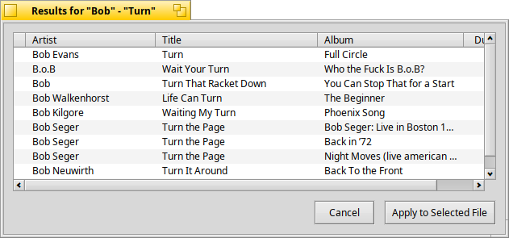

# TagView

Music Tag Viewer for Haiku.

TagView is a Haiku test/demo app for viewing and editing digital music
tags (MP3, Ogg Vorbis, FLAC), built on top of open-source libraries
including TagLib, MusicBrainz (via libmusicbrainz5) and libcoverart.

If a dropped/opened file has no tags but its artist and song name can be
guessed from the file name, TagView can look the track up on MusicBrainz
and let you pick which result matches. The Search dialog also takes an
optional track time (m:ss), which sorts results by how close their length
is to it, and an optional album, which narrows the search to recordings on
a release with that title (and uses that release for the album, year,
track and cover art).



## Design

The app is deliberately split in two:

- **`src/tagkit/`** -- reusable pieces with no app-specific wiring:
  - `TagRecord` -- a plain data holder for the tag fields TagView knows
    about (artist, title, album, track, year, genre, duration, format,
    ...), independent of any particular tagging library.
  - `read_tags()` (`TagReader`) -- fills a `TagRecord` from an audio
    file using TagLib; TagLib's types stay private to that one file.
  - `write_tags()` (`TagWriter`) -- writes a `TagRecord`'s tag fields
    back into the file with TagLib; the counterpart to `read_tags()`.
  - `fetch_cover_art()` (`CoverArtFetch`) and `CoverArtImage` -- front
    cover lookup on the Cover Art Archive via libcoverart (as in Hare),
    kept as the original compressed bytes so the same image can be shown
    and embedded unchanged.
  - `fetch_itunes_cover_art()` (`ITunesArtwork`) and `http_get()`
    (`HttpFetch`) -- a fallback cover lookup through Apple's public iTunes
    Search API, downloading with the curl that ships with Haiku. Used when
    the Cover Art Archive gives fewer than three covers; those covers are
    labelled "(iTunes)" in the picker.
  - `CoverArtCandidatesView` -- Hare's thumbnail strip for choosing between
    several covers.
  - `CoverArtView` -- a small square view showing one cover (or a
    placeholder); `read_cover_art()` pulls a file's embedded cover for it.
  - `CompactView` -- an outlined rectangle with two squares in it: the tag
    fields (name in bold, then its value, one per row) on the left and the
    cover art (a blue gradient when there is none) on the right; it all
    scales with the window. The file's name is shown under the squares,
    inside the outline. `SetTextScale()` makes the tag text larger or
    smaller (0.5-2.0); a long value wraps onto one extra line and ends in
    an ellipsis if it still doesn't fit.
  - `ClientInfo` -- the calling program's name and version, sent to
    MusicBrainz, the Cover Art Archive and iTunes as the User-Agent. The
    program defines `TAGKIT_CLIENT_NAME` and `TAGKIT_CLIENT_VERSION` (and
    optionally `TAGKIT_CLIENT_CONTACT`) in its Makefile's `DEFINES`, written
    without quotes; leaving them out gives a compiler warning and a warning
    on stderr at run time.
  - `GenreList` -- the genre names (from Hare), sorted, for drop-down menus.
  - `TagField` -- the six hand-editable fields (artist, title, album,
    track, year, genre) with helpers to read one as text and to store
    edited text back, checking numbers.
  - `TagView` (the `tagkit::TagView` class) -- a `BColumnListView`
    pre-configured to display `TagRecord` rows.

  The idea is that other apps (programs like Hare or ArmyKnife could) that
  just want a quick tag-listing widget can pull in `tagkit` directly.

  Reference documentation for `tagkit`, in the style of the Haiku Book, is in
  [`docs/index.html`](docs/index.html).

- **`src/`** -- the app itself: `TagViewApp`, `TagViewWindow` (menu bar +
  a `tagkit::TagView`, File > Open... and drag-and-drop of refs) and
  `SearchWindow` (Edit > Search MusicBrainz..., the Artist/Song/MusicBrainz dialog).

## Status

Working: the window with menu bar, file open (filtered to `*.mp3`,
`*.ogg`, `*.flac`) and drag-and-drop of files into the list. Each file's
tags and audio properties (artist, title, album, track, year, genre,
duration, format) are read with TagLib (`tagkit::read_tags()`) and shown
in the column list. The Search MusicBrainz... dialog (which closes as soon as the search starts) looks the track up on MusicBrainz
and applies the chosen match to the row. Leave the Song blank to search for
cover art only: releases by the Artist (narrowed by the Album, if given) are
checked for covers, and iTunes is asked too, so the net can be cast wider
than one recording's releases. Applying a match only changes the
row (marked with a leading bullet); **File > Save** (selected row) or
**File > Save All** writes the tags to the file(s) with TagLib, and
quitting with unsaved changes asks first.

Cover art: applying a match also looks up front covers for every release
the recording appears on. One cover is used straight away; with more than
three, a picker (thumbnails with the release title and year) opens showing
the first ones and adds the rest as they arrive. The
chosen cover shows as "New" in the Cover column and is embedded in the
file (replacing its front cover, keeping other pictures) when you save.
A preview under the list shows the cover of the last row selected -- the
pending one if you've chosen a new cover, otherwise the file's own. The
status bar reports how many releases had covers; **Edit > Choose Cover
Art...** reopens the picker for the last lookup.

The **View** menu switches between **ColumnListView** (the list with the
cover preview under it) and **CompactView** (the tags and cover art of the
last selected file in a smaller space). Select files in the list view; the
compact view shows the one selected last. This is a first pass at the
compact view. CompactView has a side menu with **Size 1**, **2** and **3**
for the text size (1 is the automatic size; 2 and 3 are larger).

Right-clicking the cover art (under the list, or the square in the compact
view) opens a menu: **Save** writes a pending cover change into the audio
file; **Insert...** opens a Tracker panel in the song's folder to pick an
image (JPEG, PNG and GIF are embedded as they are, other formats are
converted to PNG; nothing is written until Save); **Export** lists the
image formats Haiku's translators can write and opens an Export As panel
(the file name defaults to the album with the format's usual extension, e.g.
`.jpg`, `.png`, `.bmp`, `.tif`); **Remove** clears the picture from the view
and marks it for removal from the file on the next save.

Cover art also drags and drops, like in ShowImage: drop an image file from
Tracker (or an image offered by another application) onto the cover art, in
either view, and it becomes the pending cover (nothing is written until
Save); drag the cover out of the view to drop it on a Tracker window, the
desktop or another application that takes images -- as the image's own
format, or as PNG if the target asks for that.

Settings are saved in `~/config/settings/TagView` (a flattened BMessage, as
in Hare): the position and size of each window, the compact view's text size,
and the last 8 genres picked. Those recent genres head the Genre drop-down
(under "(none)"), with a line separating them from the full list.

Editing by hand: right-click the Artist, Title, Album, Track, Year or
Genre of a file -- in either view -- to change it in a small edit window
(Return or clicking elsewhere accepts typed text, Escape cancels). Genre is
a drop-down menu of the genre list borrowed from Hare (with "(none)" to
clear it); picking an entry accepts it. The compact view shows the file's
name under the squares, handy for copying a track number into the tags. The
change shows at once but stays pending: **Apply** (lower right, under the
list or under the compact view's rectangle) keeps it as an unsaved change
to the file's row, like an applied MusicBrainz match, and **Discard
Changes** puts the values back as they were. Both buttons are greyed out
unless something is pending. File > Save then writes the tags to the
file; Save and applying a MusicBrainz match also keep any pending edits
first. Track and Year must be blank or a whole number. Quitting with
unsaved (bulleted) rows asks whether to save them.

## Future ideas

- (nothing queued right now)

## Building

Uses Haiku's generic build Makefile (Makefile-Engine):

```
make
```

The resulting binary is `./TagView`.
